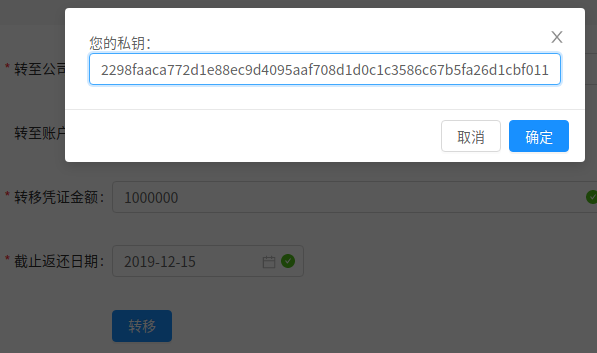

# 中山大学数据科学与计算机学院本科生实验报告（2019年秋季学期）

课程名称：区块链原理与技术             任课教师： 郑子彬

## 项目背景

a)   使用已有的开源区块链系统FISCO-BCOS，完成私有链的搭建以及新节点的加入。（截图说明搭建流程）

b)   自行编写一个智能合约并部署到私有链上，同时完成合约调用。（截图说明部署流程）

c)   使用命令查看一个区块，并对各个字段进行解释。

## 合约设计

### 信用转移

本合约可以用于记录企业产生的信用凭证、并通过支持信用凭证的转移来实现信用的下传，解决中小企业的融资困难问题。

合约内只有信用转移的过程，车企承诺 1 年后可以获得 1000 万的营收，由银行确认后，车企将获得 1000 万的信用凭证。这 1000 万的信用凭证由银行担保，因此银行将转移 1000 万的信用凭证给该车企。车企为了购买轮胎，向轮胎厂承诺 1 年后支付 500 万，这表示车企将 1000 万的信用凭证中的 500 万转移给了轮胎厂：这样车企仅剩 500 万的信用凭证可供使用，确保车企不能透支和重复使用信用凭证。轮胎厂获得 500 万的信用凭证后，可向轮毂厂继续转移 200 万的信用凭证。这样信用就传递下去而且能确保信用真实、不可篡改、由银行担保、不会多次使用。

### 贷款

企业可以凭借信用凭证向银行融资，这样企业通过将自己的信用转移给银行来实现融资的记录。这样企业通过消耗自己的信用凭证获得融资，企业就无法再借助自己的信用凭证向其他公司转移，从而多次使用信用凭证。企业还款且银行确认后，银行可以向企业转移信用凭证，归还信用值，以便再借助这些信用进行转移、销毁以及再次的融资。

## 方案设计

### 区块链数据库表结构

#### 单位表

单位表保存区块链账户在该合约中的额外信息，包括：

| 列名       | 类型    | 含义                                                         |
| ---------- | ------- | ------------------------------------------------------------ |
| addr       | address | 区块链账户地址                                               |
| name       | string  | 账户名称，一般为单位名称或者政府用单位代码（如统一信用号码） |
| bank       | bool    | 账户是否是金融机构                                           |
| gov        | bool    | 账户是否是政府机构                                           |
| inBalance  | int     | 账户借入信用凭证总和                                         |
| outBalance | int     | 账户借出信用凭证总和                                         |

#### 交易表

由于 FISCO-BCOS 仅支持 key-value 型数据库，我们需要两张表来描述凭证交易。

| 列名       | 类型              | 含义                                                         |
| ---------- | ----------------- | ------------------------------------------------------------ |
| debtor     | address           | 债务方地址                                                   |
| debtorName | string            | 债务方名称                                                   |
| debtee     | address           | 债权方地址                                                   |
| debteeName | string            | 债权方名称                                                   |
| receiptId  | int               | 交易编号                                                     |
| amount     | int               | 交易金额                                                     |
| deadline   | int（日期时间戳） | 偿还截止日期                                                 |
| valid      | int               | 交易状态<br />=0 表示交易待债权方确认<br />=1 表示交易通过<br />=2 表示交易被拒绝<br />=3 表示交易还款待债务方确认 |

### 服务器数据库表结构


### 结构体

#### 公司

Company 结构体保存公司的一些信息，比如公司名称、公司的区块链账号、公司的总信用，以及公司未偿还的向外转移的信用凭证记录。

```c#
struct Company {
    bool valid; // 公司是否存在
    address addr; // 公司账号
    string name; // 企业名称

    // 企业依据信用凭证产生的总欠款
    // 大于 0 表示该公司需要
    int256 balance;

    // 该公司对特定账户转移的信用凭证
    mapping (address => Receipt) receipts;
}
```

#### 收据

保存公司的信用凭证转移记录，如果信用凭证被取消、还款，则会销毁收据。

```cs
struct Receipt {
    bool valid; // 交易是否存在
    int256 amount; // 应收账款
}
```

### 事件

该合约会创建一些事件，以便其他合约能参与到信用凭证的转移中来，提升合约的可扩展性。

```c#
event CompanyRegistrationEvent(address addr, string name);
event TransactionEvent(address from, address to, int256 amount);
event FinanceEvent(address companyAddress, int256 amount);
event PaybackEvent(address debtorAddr, address debteeAddr, int256 amount);
```

### 合约创建

合约创建时需要指定银行账号。为了简化合约的编写，我指定了唯一的银行账号。日后可以通过管理员帐号添加或删除可信的第三方金融机构。

```kotlin
constructor (address _bankAddr) {
    bankAddr = _bankAddr;
    Company storage bank = companies[_bankAddr];
    bank.valid = true;
    bank.addr = bankAddr;
    bank.balance = 10000000000000;
    bank.name = "bank";
}
```

### 公司注册

公司创建了区块链账号后，自己调用并注册为公司。该过程不需要银行确认（或者可以改由政府确认，政府也有取消公司资质的权力）。

```c#
// 公司账号调用本函数注册为公司
// 每个账号只能注册一次，且公司名不能重复
function registerAsCompany(string name) public returns(bool) {
    if (companies[msg.sender].valid) {
        return false;
    }

    Company storage company = companies[msg.sender];
    company.valid = true;
    company.addr = msg.sender;
    company.name = name;

    emit CompanyRegistrationEvent(msg.sender, name);
    return true;
}
```

### 信用的转移

信用的转移需要同时更新双方的总信用，并且额外记录信用凭证，这样可以确保最后能追踪信用的转移，并且取消信用凭证。

该函数还支持融资：企业向银行转移信用后银行在区块链外向企业支付贷款。

```cs
// 由第三方金融机构账户调用本函数，表示 from 公司向 to 公司转移信用凭证，
// 或者 from 公司向 to 银行借款（将 from 的信用转移给银行）
function transferCredit(address from, address to, int256 amount) public returns(bool) {
    Company storage fromCompany = companies[from];
    if (!fromCompany.valid) return false;
    Company storage toCompany = companies[to];
    if (!toCompany.valid) return false;
    address verifier = msg.sender;
    // 确保只有银行才能调用该函数
    if (bankAddr != verifier) return false;
    if (fromCompany.balance < amount) return false;
    fromCompany.balance -= amount;
    toCompany.balance += amount;
    fromCompany.receipts[to].valid = true;
    fromCompany.receipts[to].amount += amount;

    emit TransactionEvent(from, to, amount);
    return true;
}
```

### 信用的创建于销毁

信用的创建于销毁和信用的转移是一样的，但是允许信用为负（表示尚未支付欠款）。

信用的创建是银行向公司转移信用的过程，销毁是公司向银行转移信用的过程。

```c#
// 由第三方金融机构账户调用该函数，表示为公司出具信用凭证
// 融资所做的检查应该由第三方金融机构人工确认，本函数调用表示机构确认可以为该公司融资
function finance(address companyAddress, int256 amount, int256 deadline) public returns(bool) {
    // 确保只有银行才能调用该函数
    if (bankAddr != msg.sender) return false;
    // 确保目标账户是公司
    Company storage company = companies[companyAddress];
    Company storage bank = companies[bankAddr];
    if (!company.valid || company.addr == bankAddr) return false;
    // 增加公司信用
    company.balance += amount;
    // 仅仅确保总 balance 量不变
    bank.balance -= amount;

    bank.receipts[companyAddress].valid = true;
    bank.receipts[companyAddress].amount += amount;

    emit FinanceEvent(companyAddress, amount);
    return true;
}

// 债权人确认还款
function payback(address debtorAddr, int256 amount) public returns(bool) {
    Company storage debtee = companies[msg.sender]; // 债权人
    Company storage debtor = companies[debtorAddr]; // 债务人
    // 如果不存在借款信息
    if (!debtee.receipts[debtorAddr].valid) return false;
    // 确保还款数不超过欠款数
    if (debtee.receipts[debtorAddr].amount < amount) return false;
    debtee.balance += amount;
    debtor.balance -= amount;
    debtee.receipts[debtorAddr].amount -= amount;
    if (debtee.receipts[debtorAddr].amount <= 0) {
        // 若不再欠款，注销欠款信息
        debtee.receipts[debtorAddr].valid = false;
        debtee.receipts[debtorAddr].amount = 0;
    }
    emit PaybackEvent(debtorAddr, msg.sender, amount);
    return true;
}
```

## 功能测试

### 创建用户

我们首先创建央行账户，通过 `get_accounts.sh` 创建一对密钥，并提供给我们的 Spring 服务器使用。


server 使用的即为管理员账户（央行账户）。

接着，在注册页面选择管理员账户执行注册过程：


该账号将和我们预先创建好的区块链账户直接绑定。由于我们已经注册了一个管理员账户，服务器之后将不再接受任何管理员账户注册请求。

### 账户审核

#### 政府和金融机构审核

央行登录其账户后可以在管理面板查看账户审核。账户审核可以确保接受的政府和金融机构账户是可信的：


审核过程需要提供央行的私钥以便签名交易：


完成审核后，可以在账户列表中查看已经审核通过的政府和金融机构账户：


#### 企业审核

对于企业，企业注册时需要提供所辖政府账号，企业账户的审核也由所辖政府审核。所辖政府登录界面审核企业：


### 用户注册

用户注册也很简单，我们依次注册车企、轮胎厂、轮毂厂如下：


注册时，会产生一对密钥，公钥将保存在服务器上，私钥将显示一次，提供给用户保存。


注册结果如下：

| 用户名称 | 意义   | 地址                                       |
| -------- | ------ | ------------------------------------------ |
| admin    | 央行   | 0x9e3340cc2be128ad54c6dffda58f36fdf2beb39d |
| bank     | 银行   | 0x8d80d5c8fffd7891b375385b34df36b260af4eb2 |
| car      | 车企   | 0x431a67a603025c86d9c817aac32f56e6b68ae4a7 |
| tyre     | 轮胎厂 | 0x6588ce768850f46eae87ccbcf27cacaba1a84f45 |
| hub      | 轮毂厂 | 0x3b537b880cca77836c1e42cc0e93a69674e02929 |

我们登入政府账号审核通过这些账户：


### 给予信用额度

类似央行的 MLF 机制以及存款准备金的机制，我们通过央行向银行和金融机构派发一定数量的信用凭证以限制这些金融机构的信用再生能力，避免金融机构透支扩张信用导致次贷危机，以便保证经济运行的稳定性。


我们点击转账按钮进入转账页面


填入转移金额以及截止日期后点击转移，继续输入私钥以便签名交易



转账成功后，将会提示等待对方确认的标识


我们登录银行账户确认该交易：


输入银行账户的私钥签名交易后，可以看到交易已经通过：


### 企业申请和转移信用凭证

银行在获得了信用凭证后，在确认了企业的盈利能力后，可以向企业派发信用凭证。向企业派发信用凭证的方式和央行向银行派发信用凭证的手段是一样的：

由银行主动转移信用凭证：


企业接受交易即可：


接下来车企便可将这笔凭证转移给其他的企业用于向银行融资。

### 返还

企业在盈利充足后，需要在截止日期前返还信用凭证消除交易记录，

企业可以选择返还部分还是返还全部：


这里我们只返还一部分，输入私钥后：


银行将收到返还请求：


银行接受后，借出凭证将减少，表示部分借款已偿还


## 五、心得体会

在设计完成区块链的供应链金融系统后，我的感触是这将大大简化企业开“证明”的手续。将信任人转移为信任机器后，如果大家都接受区块链，那么区块链的不可篡改的特性将确保区块链的所有记录都是“证明”。若相关法规得到完善，那么区块链证明将可直接成为企业间解决债务纠纷的直接有力的证据。正因如此，供应链下游的企业的融资需求将被释放。

由于原先机制下，企业间的信用凭证开具都需要第三方的金融机构认证担保，供应链下游的企业若要提供收据，则必须邀请第三方金融机构介入，而金融机构为了确保债务方证明有效，必须审查一遍供应链上游企业的所有收据，这将大大降低供应链下游企业融资的速度和可靠性。若供应链过长，这个过程很难确认，则第三方机构甚至可能拒绝担保。这是摆在我们面前的现实问题，目前中国的经济形势要求央行扶植中小微企业，但是央行缺乏能够直接触及这些企业的手段输血。而区块链则将解决该问题。企业间的信用凭证开具将依赖机器担保，因此供应链上下游所有企业的信用担保将直接依赖于供应链最上游的龙头企业的信用担保。该龙头企业的信用担保由特定的金融机构负责，那么整个供应链的金融风险都可以直接被该金融机构承担，从而避免了不同金融机构相互审查的麻烦。

此外，区块链证明将可避免证明被“双花”。目前的企业或者金融机构发行“垃圾债券”的事情时有发生，2008 年美国金融危机就是华尔街大肆发行基于垃圾债券以及其他金融产品的金融理财产品引发的债务雪崩。这些金融机构将金融产品多次打包多次出售，将 1 美元翻倍成 5~10 美元，大大降低了经济的稳定性。区块链上的证明在被使用后会被标记，区块链本身确保避免交易双花的特性，将确保证明不被双花，从而确保这些金融机构无法将区块链上的交易再次打包出售。

若央行发行了数字货币，那么智能合约在部署到人民币区块链上后，智能合约将可以直接对账户存款进行操作：能完成债务到期后的自动还款，以及信用凭证到期后的自动核查。这些债务若无法偿还，也能被立刻探知到。央行也可以收集区块链信息，助力宏观经济调控。

联盟链的落地还需法律加持，本次实验我体会到了区块链的力量，但是区块链与外界的交互还未被疏通。为了确保区块链有法律效力，还需政府和人大做好立法工作，确保区块链的有效性，并促使更多的实体参与到区块链的管理之中。

FISCO-BCOS 是一个成功的联盟链平台，但是这个平台仍然发展之中。实验过程中，我体会到这个平台的易用性仍有不足，SDK 仍有设计缺陷。希望微众银行能继续改进这个平台，助力区块链落地。