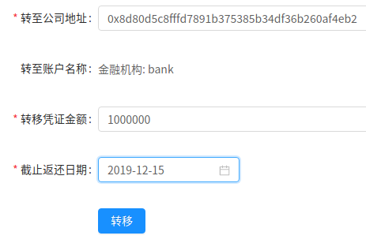

# 中山大学数据科学与计算机学院本科生实验报告（2019年秋季学期）

课程名称：区块链原理与技术             任课教师： 郑子彬

## 一、方案设计

### 合约机制

#### 信用凭证

信用凭证指企业间签发的应收账款单据，以及金融机构向车企签发的应收账款单据。简单来说，信用凭证指对企业未来盈利能力的衡量，或者企业债务。应收账款单据包含金额、逾期时间、和收款双方。

信用凭证由债务方向债权方提供，表示债务方在一定时间前将会偿还。因此信用凭证的流动方向和人民币的流动方向相反：若债务方向债权方支付人民币欠款，债权方就要向债务方返还相应的信用凭证。

#### 签发信用凭证

信用凭证分借入和借出。企业在借出信用凭证时（欠债），不能超过自己所拥有的的信用凭证总额（借入-借出），以确保企业不会透支自己的信用。银行在衡量企业的信用评级时，不能只看信用凭证净值，因为信用凭证为 0 时不代表企业不欠钱，企业信用在未来的一段时间内，可能会因为信用凭证的逾期，导致信用为负。因此银行在评估企业信用时，需要查询企业的所有交易信息。

#### 融资

信用凭证的产生和转移都是一样的，只不过信用凭证的产生是从金融机构到企业，而转移是企业和企业间的转移。企业还可以向银行融资（借入人民币），操作不太一样，企业需要将自己的信用凭证转移给银行，银行向企业提供人民币贷款。到期时企业向银行还款，银行向企业返还信用凭证。

### 账户体系

本合约将用户分为以下几种

#### 央行

合约的管理员账户（部署合约时传入）由央行控制，允许央行审核、管理金融机构和政府的账号。审核机制允许央行审查账户的真实性，避免账户被冒名顶替。

央行可以通过调用合约更新自己的信用凭证总量，和增发货币一样，该机制允许央行调节合约内的信用凭证总量，以便进行宏观调控。

央行可以通过合约向银行派发信用凭证，并设置有效期。这种方式类似央行的逆回购操作，是允许央行调节市场中信用凭证总量的另一个手段。通过审查金融机构的担保能力和信誉，央行可以借此机制精准调控每个金融机构能派发的信用凭证总量。避免金融机构过量担保，产生造成经济不稳定的因素。

央行具有合约数据库的管理权限，央行可以直接修改合约数据库，以便执行合约未提供的高级操作。通过 FISCO-BCOS 提供的 CRUD 合约来查询合约数据库的数据、对某个账号的交易进行管理。

#### 政府

政府账户只负责审核企业。由于企业比较多，管理员一般没有足够精力管理这么多账户，因此开设新的一个层级来管理企业。政府可以审核企业资质，准许企业进入区块链，也可以剥夺企业的区块链账户。

政府账户也是一个普通的账户，可以接受和转移信用凭证，地方政府可以通过其区块链账户来进行融资操作。

#### 金融机构

金融机构可以从央行获得信用凭证，代表央行对金融机构的信用评级，允许金融机构最多担保多少款项。金融机构若遇到企业希望融资，可以查询企业的相关信息：企业的借入借出凭证总额、企业的借入借出交易细表。以便金融机构结合企业的实际情况和区块链内的信用派生情况，对企业的再盈利能力进行评估。

金融机构在为企业融资时，可能需要再次验证企业的还款能力。金融机构可以查询区块链内所有企业的交易信息，因此金融机构可以沿信用凭证转移链查询到信用凭证来源，也就是查询到供应链上游企业是向哪个金融机构获取信用凭证的。通过认可供应链上游企业依赖的金融机构的信誉，这个金融机构便可以向该下游企业提供贷款。

#### 企业

企业可以查询自己的借入借出凭证，允许向其他企业转移信用凭证，前提是双方都要确认交易。这样供应链下游企业就可以借助供应链上游企业的信誉，融到人民币。

### 案例

#### 信用转移

本合约可以用于记录企业产生的信用凭证、并通过支持信用凭证的转移来实现信用的下传，解决中小企业的融资困难问题。

合约内只有信用转移的过程，车企承诺 1 年后可以获得 1000 万的营收，由银行确认后，车企将获得 1000 万的信用凭证。这 1000 万的信用凭证由银行担保，因此银行将转移 1000 万的信用凭证给该车企。车企为了购买轮胎，向轮胎厂承诺 1 年后支付 500 万，这表示车企将 1000 万的信用凭证中的 500 万转移给了轮胎厂：这样车企仅剩 500 万的信用凭证可供使用，确保车企不能透支和重复使用信用凭证。轮胎厂获得 500 万的信用凭证后，可向轮毂厂继续转移 200 万的信用凭证。这样信用就传递下去而且能确保信用真实、不可篡改、由银行担保、不会多次使用。

#### 贷款

企业可以凭借信用凭证向银行融资，这样企业通过将自己的信用转移给银行来实现融资的记录。这样企业通过消耗自己的信用凭证获得融资，企业就无法再借助自己的信用凭证向其他公司转移，从而多次使用信用凭证。企业还款且银行确认后，银行可以向企业转移信用凭证，归还信用值，以便再借助这些信用进行转移、销毁以及再次的融资。

### 数据流图

下图描述了信用凭证和人民币贷款的流动方向。其中银行左侧的为信用凭证流入，银行右侧为人民币贷款流出。

## 二、存储设计

### 区块链合约存储

合约采用数据库存储绝大多数内容，不过合约内仍然会包含一部分存储功能。

合约内包含一些描述这些表的结构体：

#### 实体

```c#
struct Company {
    address addr; // 公司账号
    string name; // 企业名称
    bool bank; // 是否是金融机构，可以向公司颁发信用凭证
    bool gov; // 是否是政府机关，有权授权将账户标记为公司账户

    // 企业依据信用凭证产生的总欠款
    // 大于 0 表示该公司还可以签发应收账款，否则表示公司必须向债权方还款（支付应收账款）
    // 对于金融机构，表示能签发的最大信用额度

    // 获得的尚未返还的信用凭证总量
    int256 inBalance;
    // 签发的尚未收回的信用凭证总量
    int256 outBalance;
}
```

#### 交易

```c#
struct Receipt {
    address debtor; // 债务方地址
    string debtorName; // 债务方名称
    address debtee; // 债权方地址
    string debteeName; // 债权方名称
    int receiptId;  // 交易 ID
    int amount;     // 交易金额
    int deadline;   // 截止日期
    int valid; // 0 - 待审核，1 - 接受，2 - 不接受, 3 - 还款阶段
}
```

#### 交易 ID

```solidity
// 收据 id，每次创建由该公司的转出交易时加 1
int nextReceiptId;
```

合约可以保证计算时不出现并发（出现并发就是分叉了，但不会有多线程的竞争问题），因此我们用一个全局变量记录交易 ID。

#### 管理员帐号

合约的管理员帐号在部署时约定，并存储在合约内：

```c#
// 央行账号
// 1. 用于承认和撤销金融机构资格
// 2. 用于承认政府和公司账号
address adminAddr;
```

### 区块链数据库表结构

#### 实体表

实体表保存区块链账户在该合约中的额外信息，和实体结构体 `struct Company` 对应。包括：

| 列名       | 类型    | 含义                                                         |
| ---------- | ------- | ------------------------------------------------------------ |
| addr       | address | 区块链账户地址                                               |
| name       | string  | 账户名称，一般为单位名称或者政府用单位代码（如统一信用号码） |
| bank       | bool    | 账户是否是金融机构                                           |
| gov        | bool    | 账户是否是政府机构                                           |
| inBalance  | int     | 账户借入信用凭证总和                                         |
| outBalance | int     | 账户借出信用凭证总和                                         |

#### 交易表

由于 FISCO-BCOS 仅支持 key-value 型数据库，我们需要两张表来描述凭证交易，“转入交易表”和“转出交易表”。两张表的区别在于转出交易表的主键为债务方地址 debtor；转入交易表的主键为债权方地址 debtee

| 列名       | 类型              | 含义                                                         |
| ---------- | ----------------- | ------------------------------------------------------------ |
| debtor     | address           | 债务方地址                                                   |
| debtorName | string            | 债务方名称                                                   |
| debtee     | address           | 债权方地址                                                   |
| debteeName | string            | 债权方名称                                                   |
| receiptId  | int               | 交易编号                                                     |
| amount     | int               | 交易金额                                                     |
| deadline   | int（日期时间戳） | 偿还截止日期                                                 |
| valid      | int               | 交易状态<br />=0 表示交易待债权方确认<br />=1 表示交易通过<br />=2 表示交易被拒绝<br />=3 表示交易还款待债务方确认 |

### 服务器数据库表结构

## 三、合约核心功能

### 合约事件

该合约会创建一些事件，以便其他合约能参与到信用凭证的转移中来，提升合约的可扩展性。

```c#
// 公司注册事件
event CompanyRegistration(address addr, string name);
// 银行注册事件
event BankRegistration(address addr, string name);
// 政府注册事件
event GovernmentRegistration(address addr, string name);

// 信用凭证交易发起事件
event TransactionBegin(address debtor, address debtee, int receiptId, int256 amount);
// 信用凭证交易接受事件
event TransactionEnd(address debtor, address debtee, int receiptId);

// 信用凭证销毁发起事件
event ReturnBegin(address debtor, address debtee, int receiptId, int amount);
// 信用凭证销毁接受事件
event ReturnEnd(address debtor, address debtee, int receiptId, int amount);
```

### 金融机构和政府机构注册

根据设计，金融机构注册需要央行确认。通过在管理控制台注册时，管理控制台会提交注册信息给央行账户，央行账户确认后将注册信息提交到区块链上。政府机构账号同理。区块链合约注册函数的代码如下：

```c#
// 央行将指定账户设置为金融机构，信用额度
function registerBank(address addr, string name) public {
    require(msg.sender == adminAddr, "Only the Central Bank is allowed to banks registration");
    insertCompany(addr, name, true, false, 0, 0);
    emit BankRegistration(addr, name);
}

// 政府账号调用本函数将账户注册为公司
// 每个账号只能注册一次
function registerGovernment(address addr, string name) public {
    require(msg.sender == adminAddr, "Only the Central Bank is allowed to governments registration");
    insertCompany(addr, name, false, true, 0, 0);
    emit GovernmentRegistration(addr, name);
}
```

区块链合约保证只有央行账户可以调用该合约，将指定的金融机构账户设置为金融机构。

### 企业注册

企业注册和其他不同，企业注册需要政府审核，因此检查 `msg.sender` 是否是政府而不是央行。和银行注册类似，企业在管理控制台注册时，需要提供政府账号，将注册信息提交给政府审核。

```csharp
// 政府账号调用本函数将账户注册为公司
// 每个账号只能注册一次
function registerCompany(address addr, string name) public {
    findCompany(msg.sender);
    require(company.gov, "Only governments are allowed to companies registration");
    insertCompany(addr, name, false, false, 0, 0);
    emit CompanyRegistration(addr, name);
}
```

### 转账

转账分为提交转账和确认转账两个步骤。合约首先将转账提交到数据库中记录，允许债权人确认接受转账和拒绝转账。转账为等待接受、接受、拒绝的状态将被记录到数据库中。被拒绝的转账记录会保留。

其中，提交转账不会改变双方的账款，只有债权方接受了转账后才会改变双方的账款。

```csharp
// 由第三方金融机构账户调用本函数，表示 debtor 公司向 debtee 公司转移信用凭证，
// 或者 debtor 公司向 debtee 银行借款（将 debtor 的信用转移给银行表示融资）
// 或者 debtor 银行向 debtee 公司提供信用凭证
// debtor=msg.sender
function transferCredit(address debtee, int amount, int deadline) public {
    require(amount > 0, "You must transfer credits non negative");
    int debtorIn; int debtorOut; (debtorIn, debtorOut) = findCompanyBalance(msg.sender); // 债务人
    int debteeIn; int debteeOut; (debteeIn, debteeOut) = findCompanyBalance(debtee); // 债权人
    require(debtorIn - debtorOut >= amount, "Debtor does not have enough balance");

    nextReceiptId++;

    insertReceipt("t_in_receipt", toString(debtee), msg.sender, debtee, nextReceiptId, amount, deadline, 0);
    insertReceipt("t_out_receipt", toString(msg.sender), msg.sender, debtee, nextReceiptId, amount, deadline, 0);

    emit TransactionBegin(msg.sender, debtee, nextReceiptId, amount);
}

// 由债权人调用，表示接受债务人转移的信用凭证
// valid = 1 表示接受转移，valid = 2 表示拒绝转移
function acceptTransferCredit(int receiptId, int valid) public {
    require(valid == 1 || valid == 2, "Only accepting or declining are allowed");
    findReceipt("t_in_receipt", toString(msg.sender), receiptId);
    require(receipt.valid == 0, "Receipt to be accepted should be pending");

    if (valid == 1) {
        int debtorIn; int debtorOut; (debtorIn, debtorOut) = findCompanyBalance(msg.sender); // 债务人
        int debteeIn; int debteeOut; (debteeIn, debteeOut) = findCompanyBalance(debtee); // 债权人
        debtorOut += receipt.amount;
        debteeIn += receipt.amount;
        updateCompanyBalance(msg.sender, debtorIn, debtorOut);
        updateCompanyBalance(debtee, debteeIn, debteeOut);
    }

    updateReceiptInt("t_in_receipt", toString(receipt.debtee), receiptId, "valid", valid, false);
    updateReceiptInt("t_out_receipt", toString(receipt.debtor), receiptId, "valid", valid, false);

    emit TransactionEnd(receipt.debtor, receipt.debtee, receiptId);
}
```

### 还款

还款分为提交还款和确认还款两个步骤。合约首先将还款提交到数据库中记录（通过更新转账数据库实现），允许债务人确认接受还款和拒绝还款。还款为等待接受、接受、拒绝的状态将被记录到数据库中。被拒绝的还款记录不像被拒绝的转账记录，不会被保留。

和转账一样，还款未被确认前不会改变双方的账款，只有债务方接受了还款后才会改变双方的账款。

```csharp
// 由债权人调用，表示返还信用凭证
// debtee 公司向 debtor 公司返还信用凭证（表示 debtor 公司向 debtee 公司支付货款）
// debtee 公司向 debtor 银行返还信用凭证（表示期限前撤销信用凭证）
// debtee 银行向 debtor 公司返还信用凭证（公司完成融资还款）
function returnCredit(int receiptId, int amount) public {
    findReceipt("t_in_receipt", toString(msg.sender), receiptId);
    int debtorIn; int debtorOut; (debtorIn, debtorOut) = findCompanyBalance(receipt.debtor); // 债务人
    int debteeIn; int debteeOut; (debteeIn, debteeOut) = findCompanyBalance(receipt.debtee); // 债权人

    require(amount > 0, "You must return credits non negative");
    require(receipt.amount >= amount, "Cannot return credit more than amount transfered at first");
    require(receipt.valid == 1, "Receipt should be already accepted");

    updateReceiptInt("t_in_receipt", toString(receipt.debtee), receiptId, "valid", 3, false);
    updateReceiptInt("t_out_receipt", toString(receipt.debtor), receiptId, "valid", 3, false);

    // 只更新一方的账款，用两侧账款差表示还款总额
    updateReceiptInt("t_out_receipt", toString(receipt.debtor), receiptId, "amount", receipt.amount - amount, false);

    emit ReturnBegin(receipt.debtor, receipt.debtee, receiptId, amount);
}

// 由债务人调用，表示接受债权人返还的信用凭证
function acceptReturnCredit(int receiptId, int valid) public {
    require(valid == 1 || valid == 2, "Only accepting or declining are allowed");

    findReceipt("t_out_receipt", toString(msg.sender), receiptId);
    Receipt memory outReceipt = receipt;
    findReceipt("t_in_receipt", toString(receipt.debtee), receiptId);
    Receipt memory inReceipt = receipt;
    require(inReceipt.valid == outReceipt.valid, "Receipt states are nonconsistent");
    require(inReceipt.valid == 3, "Only Receipts pending for returning are allowed to accept");
    require(outReceipt.amount < inReceipt.amount, "Receipts states are nonconsistent");

    int debtorIn; int debtorOut; (debtorIn, debtorOut) = findCompanyBalance(receipt.debtor); // 债务人
    int debteeIn; int debteeOut; (debteeIn, debteeOut) = findCompanyBalance(receipt.debtee); // 债权人
    int amount = inReceipt.amount - outReceipt.amount;

    if (valid == 1) { // 接受返还信用凭证
        // 同步两侧账款
        updateReceiptInt("t_in_receipt", toString(receipt.debtee), receiptId, "amount", outReceipt.amount, true);
        updateReceiptInt("t_out_receipt", toString(receipt.debtor), receiptId, "amount", outReceipt.amount, true);

        debtorOut -= amount;
        debteeIn -= amount;
        updateCompanyBalance(receipt.debtor, debtorIn, debtorOut);
        updateCompanyBalance(receipt.debtee, debteeIn, debteeOut);
    } else { // 拒绝返还信用凭证，恢复账款
        // 恢复单侧账款
        updateReceiptInt("t_out_receipt", toString(receipt.debtor), receiptId, "amount", inReceipt.amount, true);
    }

    // 恢复账款到接受状态
    updateReceiptInt("t_in_receipt", toString(receipt.debtee), receiptId, "valid", 1, false);
    updateReceiptInt("t_out_receipt", toString(receipt.debtor), receiptId, "valid", 1, false);

    emit ReturnEnd(receipt.debtor, receipt.debtee, receiptId, amount);
}
```

## 四、功能测试

### 创建用户

我们首先创建央行账户，通过 `get_accounts.sh` 创建一对密钥，并提供给我们的 Spring 服务器使用。


server 使用的即为管理员账户（央行账户）。

接着，在注册页面选择管理员账户执行注册过程：


该账号将和我们预先创建好的区块链账户直接绑定。由于我们已经注册了一个管理员账户，服务器之后将不再接受任何管理员账户注册请求。

### 账户审核

#### 政府和金融机构审核

央行登录其账户后可以在管理面板查看账户审核。账户审核可以确保接受的政府和金融机构账户是可信的：


审核过程需要提供央行的私钥以便签名交易：


完成审核后，可以在账户列表中查看已经审核通过的政府和金融机构账户：


#### 企业审核

对于企业，企业注册时需要提供所辖政府账号，企业账户的审核也由所辖政府审核。所辖政府登录界面审核企业：


### 用户注册

用户注册也很简单，我们依次注册车企、轮胎厂、轮毂厂如下：


注册时，会产生一对密钥，公钥将保存在服务器上，私钥将显示一次，提供给用户保存。


注册结果如下：

| 用户名称 | 意义   | 地址                                       |
| -------- | ------ | ------------------------------------------ |
| admin    | 央行   | 0x9e3340cc2be128ad54c6dffda58f36fdf2beb39d |
| bank     | 银行   | 0x8d80d5c8fffd7891b375385b34df36b260af4eb2 |
| car      | 车企   | 0x431a67a603025c86d9c817aac32f56e6b68ae4a7 |
| tyre     | 轮胎厂 | 0x6588ce768850f46eae87ccbcf27cacaba1a84f45 |
| hub      | 轮毂厂 | 0x3b537b880cca77836c1e42cc0e93a69674e02929 |

我们登入政府账号审核通过这些账户：


### 给予信用额度

类似央行的 MLF 机制以及存款准备金的机制，我们通过央行向银行和金融机构派发一定数量的信用凭证以限制这些金融机构的信用再生能力，避免金融机构透支扩张信用导致次贷危机，以便保证经济运行的稳定性。


我们点击转账按钮进入转账页面



填入转移金额以及截止日期后点击转移，继续输入私钥以便签名交易


转账成功后，将会提示等待对方确认的标识


我们登录银行账户确认该交易：


输入银行账户的私钥签名交易后，可以看到交易已经通过：


### 企业申请和转移信用凭证

银行在获得了信用凭证后，在确认了企业的盈利能力后，可以向企业派发信用凭证。向企业派发信用凭证的方式和央行向银行派发信用凭证的手段是一样的：

由银行主动转移信用凭证：


企业接受交易即可：


接下来车企便可将这笔凭证转移给其他的企业用于向银行融资。

### 返还

企业在盈利充足后，需要在截止日期前返还信用凭证消除交易记录，

企业可以选择返还部分还是返还全部：


这里我们只返还一部分，输入私钥后：


银行将收到返还请求：


银行接受后，借出凭证将减少，表示部分借款已偿还


## 五、界面展示


## 六、心得体会

在设计完成区块链的供应链金融系统后，我的感触是这将大大简化企业开“证明”的手续。将信任人转移为信任机器后，如果大家都接受区块链，那么区块链的不可篡改的特性将确保区块链的所有记录都是“证明”。若相关法规得到完善，那么区块链证明将可直接成为企业间解决债务纠纷的直接有力的证据。正因如此，供应链下游的企业的融资需求将被释放。

由于原先机制下，企业间的信用凭证开具都需要第三方的金融机构认证担保，供应链下游的企业若要提供收据，则必须邀请第三方金融机构介入，而金融机构为了确保债务方证明有效，必须审查一遍供应链上游企业的所有收据，这将大大降低供应链下游企业融资的速度和可靠性。若供应链过长，这个过程很难确认，则第三方机构甚至可能拒绝担保。这是摆在我们面前的现实问题，目前中国的经济形势要求央行扶植中小微企业，但是央行缺乏能够直接触及这些企业的手段输血。而区块链则将解决该问题。企业间的信用凭证开具将依赖机器担保，因此供应链上下游所有企业的信用担保将直接依赖于供应链最上游的龙头企业的信用担保。该龙头企业的信用担保由特定的金融机构负责，那么整个供应链的金融风险都可以直接被该金融机构承担，从而避免了不同金融机构相互审查的麻烦。

此外，区块链证明将可避免证明被“双花”。目前的企业或者金融机构发行“垃圾债券”的事情时有发生，2008 年美国金融危机就是华尔街大肆发行基于垃圾债券以及其他金融产品的金融理财产品引发的债务雪崩。这些金融机构将金融产品多次打包多次出售，将 1 美元翻倍成 5~10 美元，大大降低了经济的稳定性。区块链上的证明在被使用后会被标记，区块链本身确保避免交易双花的特性，将确保证明不被双花，从而确保这些金融机构无法将区块链上的交易再次打包出售。

若央行发行了数字货币，那么智能合约在部署到人民币区块链上后，智能合约将可以直接对账户存款进行操作：能完成债务到期后的自动还款，以及信用凭证到期后的自动核查。这些债务若无法偿还，也能被立刻探知到。央行也可以收集区块链信息，助力宏观经济调控。

联盟链的落地还需法律加持，本次实验我体会到了区块链的力量，但是区块链与外界的交互还未被疏通。为了确保区块链有法律效力，还需政府和人大做好立法工作，确保区块链的有效性，并促使更多的实体参与到区块链的管理之中。

FISCO-BCOS 是一个成功的联盟链平台，但是这个平台仍然发展之中。实验过程中，我体会到这个平台的易用性仍有不足，SDK 仍有设计缺陷。希望微众银行能继续改进这个平台，助力区块链落地。